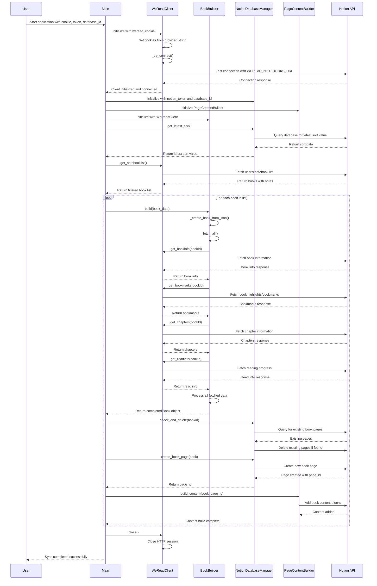

# WeRead2Notion S quence Diagram (时序图)

## Key Changes After Removing Chrome Refresh:

1. **Simplified Initialization**: WeReadClient now requires a cookie parameter
2. **Direct Cookie Usage**: Uses provided cookie string without browser automation
3. **No Cookie Manager**: Removed Selenium dependency
4. **Streamlined Flow**: More direct process without retry logic